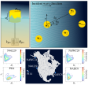

# WEC Farm Optimization Toolbox

Solve concurrent plant, control, and layout optimization of wave energy converter farms using regular or irregular waves for heaving cylinder devices with considerations of wave probabilities for various site locations

Two methods are available for estimating hydrodynamic coefficients within the optimization loop: (i) Multi scattering (MS), which is computationally expensive, and (ii) surrogate models with many-body expansion (SM_MBE), which offers improved computational efficiency.  

The toolbox enables the following investigations:

* Plant optimziation (WEC radius and slenderness ratio)
* Control parameter optimization (WEC PTO damping and stiffness) 
* Layout optimization (x and y coordinates of WEC devices within a farm)
* Concurrent plant and layout optimization
* Concurrent plant and control optimization
* Concurrent plant, control, and layout optimization




## Install
* Download and extract the [project files]() 
* Run INSTALL_Submission.m in MATLAB and ensure that all tests for inclusion of the required files and packages have passed

```matlab
INSTALL_Tool
```

A good place to start is to open Main_WEC_FD.m. In this script, you can set the number of WECs, select the desired case study, the method for estimating hydrodynamic coefficients, the region of interest for site location, and the optimization solver. 


## Citation
Please cite the following articles if you use the toolbox: 

* S Azad, DR Herber. **Concurrent Probabilistic Control Co-Design and Layout Optimization of Wave Energy Converter Farms Using Surrogate Modeling**. In ASME 2023 International Design Engineering Technical Conferences, DETC2023-116896, Aug. 2023. [[DOI]](https://doi.org/10.1115/detc2023-116896) [[PDF]](https://arxiv.org/pdf/2308.06418.pdf)
 